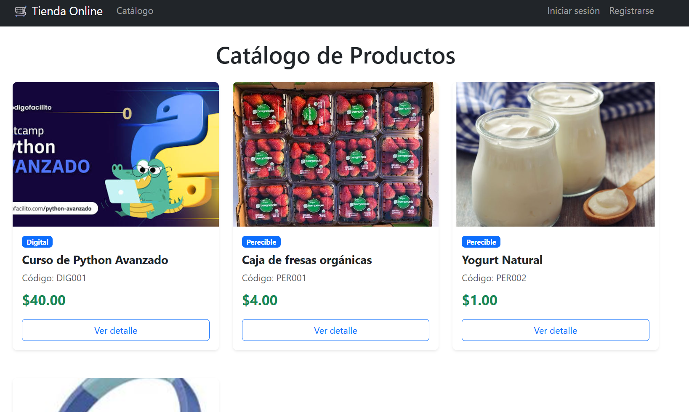
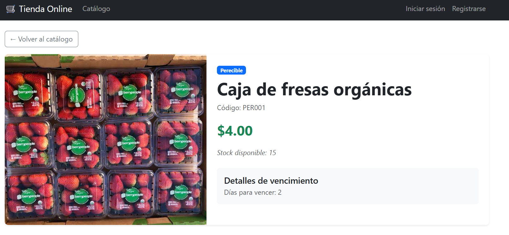
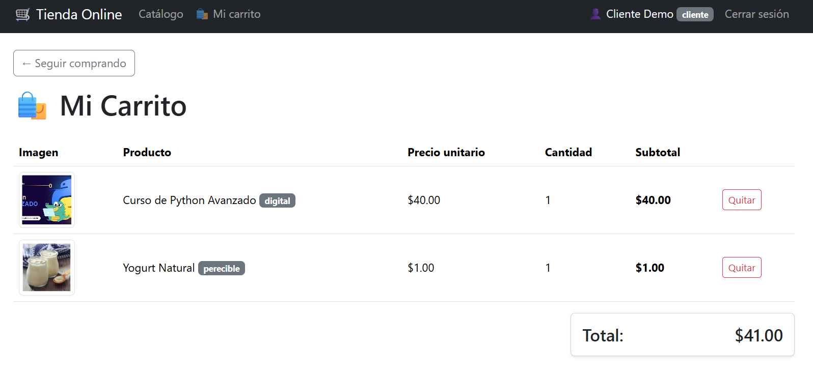

# 🛒 Tienda Online con Flask y PostgreSQL

Aplicación web e-commerce desarrollada con Flask, SQLAlchemy y PostgreSQL. Implementa un catálogo de productos con herencia, sistema de autenticación con roles, carrito de compras funcional y subida de imágenes.

## 🚀 Instalación y Ejecución

1. Clona este repositorio y entra a la carpeta:
   ```bash
   git clone https://github.com/Carlos18nv/PoyectoFlask.git
   cd PoyectoFlask
   ```

2. Activa el entorno virtual:
   - **Windows:** `venv\Scripts\activate`
   - **Linux/Mac:** `source venv/bin/activate`

3. Ejecuta el script para inicializar/resetear la base de datos (creará las tablas y datos de prueba):
   ```bash
   python init_db.py
   ```

4. Inicia el servidor de desarrollo de Flask:
   ```bash
   python app.py
   ```
   
5. Abre en tu navegador web: `http://127.0.0.1:5000`

## 🔑 Credenciales de Prueba

Al ejecutar `init_db.py` se generan automáticamente los siguientes usuarios de prueba:

- **Administrador (Gestión de productos):**
  - Correo: `admin@tienda.com`
  - Contraseña: `admin123`

- **Cliente (Compras y carrito):**
  - Correo: `cliente@tienda.com`
  - Contraseña: `cliente123`

## 📸 Capturas de Pantalla

### Catálogo de Productos
*(Asegúrate de guardar la imagen con el nombre `catalogo.png` en esta misma carpeta)*


### Detalle del Producto
*(Asegúrate de guardar la imagen con el nombre `detalle.png` en esta misma carpeta)*


### Carrito de Compras
*(Asegúrate de guardar la imagen con el nombre `carrito.png` en esta misma carpeta)*

